# From Black-Box to Explainability: Probabilistic Automata for Time Series Analysis

Bu repository, zaman serisi anomali tespiti için iki modelleme yaklaşımını karşılaştırır:

1. **Black-box derin öğrenme modelleri:** LSTM ve 1D-CNN
2. **Yorumlanabilir otomata tabanlı model:** PAA + SAX + sliding-window örüntüleri + frekans tabanlı geçiş olasılıkları

Amaç yalnızca en yüksek skoru bulmak değil; modellerin **veri setine bağlı davranışını**, **gürültüye dayanıklılığını**, **unseen pattern yönetimini**, **parametre hassasiyetini** ve **olasılıksal açıklanabilirliğini** sistematik olarak incelemektir.


---

## 1. Proje Özeti

Bu çalışmanın kapsamı, iki farklı endüstriyel zaman serisi veri seti üzerinde anomali tespiti için olasılıksal otomata tabanlı bir model geliştirmek ve bu modelin davranışını farklı deney senaryoları altında analiz etmektir.

Projede iki temel yaklaşım uygulanmıştır:

- **Derin öğrenme modelleri:** LSTM ve 1D-CNN.
- **Olasılıksal otomata modeli:** PCA, PAA ve SAX dönüşümleriyle elde edilen sembolik zaman serisi üzerinden transition probability tabanlı anomali tespiti.

Otomata modeli, derin öğrenme modellerinden farklı olarak her karar için şu bilgileri üretebilir:

- önceki state,
- gelen pattern,
- pattern'in seen/unseen durumu,
- unseen pattern için Levenshtein tabanlı en yakın bilinen state eşlemesi,
- transition probability,
- path probability,
- confidence score,
- normal/anomali kararı.

Bu nedenle otomata yaklaşımı performans olarak her zaman DL modellerinden güçlü olmasa da, karar sürecini açıklama açısından daha şeffaf bir yapı sunar.


---

## 2. Veri Setleri

Projede iki veri seti kullanılmıştır.

### 2.1 SKAB

SKAB veri setinde yalnızca `valve1` ve `valve2` klasörleri kullanılmıştır. Bu klasörlerdeki tüm `.csv` dosyaları birleştirilmiş ve iki metadata sütunu eklenmiştir:

- `source_group`: satırın `valve1` veya `valve2` klasöründen geldiğini gösterir.
- `source_file`: satırın hangi CSV dosyasından geldiğini gösterir. Örnek: `valve1/0.csv`.

Bu sütunlar model girdisi değildir; sadece veri takibi, dosya bazlı split ve sonuç analizi için kullanılmıştır.

SKAB özet bilgileri:

| Özellik | Değer |
|---|---:|
| Satır sayısı | 22472 |
| Feature sayısı | 8 |
| Target sütunu | `anomaly` |
| Normal örnek sayısı | 14646 |
| Anomali örnek sayısı | 7826 |
| Kullanılan source file sayısı | 20 |
| `valve1` satır sayısı | 18160 |
| `valve2` satır sayısı | 4312 |

SKAB tarafında aynı dosyadan gelen satırların hem train hem test içinde bulunmasını engellemek için `source_file` tabanlı group split kullanılmıştır. Bu tercih dosya bazlı veri sızıntısını azaltır.

### 2.2 BATADAL

BATADAL veri setinde zaman bilgisi içeren `DATETIME` sütunu sıralama için kullanılmış, model girdisine dahil edilmemiştir. Hedef sütun `ATT_FLAG` olarak belirlenmiştir. Normal sınıf `-999`, saldırı/anomali sınıfı `1` olarak temsil edilir.

BATADAL özet bilgileri:

| Özellik | Değer |
|---|---:|
| Satır sayısı | 4177 |
| Feature sayısı | 43 |
| Target sütunu | `ATT_FLAG` |
| Time sütunu | `DATETIME` |
| Normal örnek sayısı | 3958 |
| Anomali örnek sayısı | 219 |
| Train satır sayısı | 2506 |
| Validation satır sayısı | 835 |
| Test satır sayısı | 836 |

BATADAL için random split yapılmamıştır. Veri zaman sırası korunarak %60 train, %20 validation ve %20 test olarak ayrılmıştır.

---

## 3. Veri Ön İşleme

Veri ön işleme süreci iki model ailesi için ortak bir mantığa sahiptir: model girdisi olarak yalnızca sensör değişkenleri kullanılmış, target ve metadata sütunları model girdisinden çıkarılmıştır.

### 3.1 Ortak ön işleme adımları

1. Ham veri setleri yüklenir.
2. Target ve metadata sütunları ayrılır.
3. Feature sütunları belirlenir.
4. Train verisi üzerinde normalizasyon fit edilir.
5. Validation/test verileri train üzerinde öğrenilen normalizasyon parametreleriyle dönüştürülür.
6. Anomali etiketleri ikili sınıfa dönüştürülür: `0 = normal`, `1 = anomaly`.

### 3.2 Otomata için ek dönüşümler

Otomata modelinin sembolik tek boyutlu bir girişe ihtiyaç duyması nedeniyle şu ek adımlar uygulanmıştır:

```txt
Çok değişkenli sensör verisi
        ↓
Standard scaling
        ↓
PCA ile PC1 çıkarımı
        ↓
PAA ile segmentlere ayırma
        ↓
SAX ile sembolik dizileştirme
        ↓
Sliding-window pattern çıkarımı
        ↓
Olasılıksal otomata eğitimi
```

PCA çok değişkenli sensör davranışını tek bileşene indirger. PAA zaman serisini segmentlere böler. SAX ise sayısal segmentleri sembolik alfabe ile temsil eder.

---

## 4. Kullanılan Modeller

### 4.1 Derin Öğrenme Modelleri

Bu sürümde iki derin öğrenme modeli uygulanmıştır:

- **LSTM:** Zaman bağımlılıklarını yakalamak için kullanılan recurrent model.
- **1D-CNN:** Zaman pencereleri üzerinde lokal örüntüleri yakalamak için kullanılan konvolüsyonel model.

Derin öğrenme modelleri sliding-window ile oluşturulan çok değişkenli sekanslar üzerinde eğitilmiştir. Modeller PyTorch ile uygulanmıştır. Eğitimde 5 farklı random seed kullanılmıştır:

```txt
[42, 123, 2026, 7, 999]
```

SKAB için 5 split/fold ve 5 seed kullanıldığı için her DL modeli 25 run ile özetlenmiştir. BATADAL zaman sıralı deterministik split kullandığı için her DL modeli 5 seed ile çalıştırılmıştır.

### 4.2 Otomata Tabanlı Model

Otomata tarafında her sliding-window pattern bir state olarak ele alınır. Eğitim aşamasında state geçişleri sayılır ve transition probability değerleri hesaplanır.

Modelin temel varsayımı şudur:

```txt
Eğitim verisinde sık görülen state transition → normal davranış
Eğitim verisinde az görülen veya hiç görülmeyen transition → anomali adayı
```


Otomata modeli supervised bir derin öğrenme modeli gibi loss minimizasyonu yapmaz. Model eğitimi, train verisinden çıkarılan sembolik state transition frekanslarının öğrenilmesi ve bu frekanslardan geçiş olasılıklarının hesaplanmasıdır.

Bu nedenle otomata modelinin başarısı doğrudan sembolik temsil kalitesine bağlıdır. PCA, PAA, SAX, window size ve alphabet size seçimleri modelin hem performansını hem de state-transition yapısının yoğunluğunu belirler.

---

### 4.2.1 PAA

PAA, zaman serisini sabit sayıda segmente ayırarak her segmentin ortalamasını alır. Böylece seri daha kısa ve daha özet bir forma dönüştürülür.

Bu projede PAA, PCA ile elde edilen tek boyutlu `pc1` dizisine uygulanmıştır.

PAA kullanılma amacı:

* zaman serisini daha kompakt temsil etmek,
* küçük gürültü etkilerini yumuşatmak,
* SAX dönüşümü öncesinde daha kararlı bir temsil elde etmek.

Ancak PAA aynı zamanda bazı kısa süreli anomali sinyallerinin yumuşamasına neden olabilir. Bu nedenle model performansı üzerinde doğrudan etkisi vardır.

---

### 4.2.2 SAX

SAX, sayısal zaman serisini sembolik dizilere dönüştürür. PAA ile elde edilen değerler alphabet size parametresine göre sembollere ayrılır.

Örnek:

```txt
alphabet_size = 3 → a, b, c
alphabet_size = 4 → a, b, c, d
```

SAX dönüşümü sonucunda model artık sayısal değerlerle değil sembolik örüntülerle çalışır.

SAX kullanılma amacı:

* zaman serisini sembolik hale getirmek,
* otomata state yapısını kurabilmek,
* transition probability hesaplamasına uygun pattern dizisi üretmek.

Alphabet size arttıkça sembolik çözünürlük artar. Ancak bu durum state uzayını büyütür ve transition matrix yapısını daha seyrek hale getirebilir.

---

### 4.2.3 Sliding Window Pattern Extraction

SAX sonucunda elde edilen sembolik dizi üzerinde sliding window uygulanır.

Örnek:

```txt
symbol_sequence = a b b c a
window_size = 3
patterns = abb, bbc, bca
```

Her pattern otomata içinde bir state olarak ele alınır.

Window size arttıkça state daha uzun bağlam bilgisi taşır. Ancak state sayısı artar ve aynı transitionların tekrar görülme olasılığı azalır.

Bu nedenle window size parametresi performans, state count ve transition density üzerinde doğrudan etkilidir.

---

### 4.2.4 Probabilistic Transition Model

Otomata modeli, train verisinden çıkarılan pattern dizisi üzerinden state transition count hesaplar.

Bir `s_i` state’inden `s_j` state’ine geçiş için olasılık şu şekilde hesaplanır:

```txt
P(s_j | s_i) = count(s_i → s_j) / total_outgoing_transitions(s_i)
```

Bu olasılık modelin anomaly decision mekanizmasında kullanılır.

Eğer geçiş olasılığı belirlenen anomaly threshold değerinin altındaysa model bu geçişi anomali adayı olarak değerlendirir.

BATADAL için anomaly threshold validation split üzerinde seçilmiştir. Aday threshold değerleri:

```txt
0.000001
0.00001
0.0001
0.001
0.005
0.01
0.03
0.05
0.1
```

Validation set üzerinde en yüksek F1-score değerini veren threshold test set üzerinde kullanılmıştır.

Eğitimde hiç görülmeyen transitionlar için küçük bir fallback probability kullanılır:

```txt
fallback_probability = 0.000001
```

Bu değer Laplace smoothing değildir. Yalnızca gözlenmeyen geçişlere düşük olasılıklı bir karar skoru atamak için kullanılır.

---

### 4.2.5 Unseen Pattern Handling with Levenshtein

Test sırasında eğitimde hiç görülmemiş bir pattern gelebilir. Bu durumda model duramaz; bunun yerine en yakın bilinen state’e eşleme yapar.

Bu projede unseen pattern yönetimi için Levenshtein distance kullanılmıştır.

Unseen pattern geldiğinde:

1. Gelen pattern eğitim state sözlüğünde aranır.
2. Eğer bulunamazsa tüm bilinen state’ler ile Levenshtein distance hesaplanır.
3. En düşük mesafeye sahip state seçilir.
4. Pattern bu state’e map edilir.
5. Geçiş olasılığı ve path probability hesaplanır.
6. Karar ve explanation çıktısı üretilir.

Bu yapı, modelin unseen pattern durumunda da açıklanabilir karar üretmesini sağlar.

---
---

## 5. Deneysel Tasarım

### 5.1 Original Scenario

Original senaryoda test verisi herhangi bir bozulma uygulanmadan değerlendirilir.

- BATADAL: Zaman sıralı %60/%20/%20 split.
- SKAB: source_file tabanlı group split.
- Otomata: fixed parametrelerde `window_size=4`, `alphabet_size=3`.

### 5.2 Gaussian Noise Scenario

Gaussian noise senaryosunda test feature değerlerine düşük seviyeli gürültü eklenir:

```yaml
mean: 0.0
std: 0.05
```

Bu senaryo modelin düşük seviyeli sensör gürültüsüne dayanıklılığını ölçmek için kullanılmıştır.

### 5.3 Unseen Pattern Scenario

Unseen-only senaryosu yalnızca eğitim otomatasında bulunmayan test pattern'ları üzerinde yapılan ayrı bir diagnostik analizdir.

Bu nedenle unseen-only F1 değeri original/noise full-test F1 değerleriyle doğrudan aynı değerlendirme evreninde karşılaştırılmamalıdır.

- Original/noise: tüm test transition'ları.
- Unseen-only: sadece eğitim state sözlüğünde bulunmayan test pattern alt kümesi.

Unseen pattern geldiğinde Levenshtein distance ile en yakın bilinen state bulunur ve model bu eşleme üzerinden karar üretir.

### 5.4 Parametre Analizi

Otomata için iki temel parametre test edilmiştir:

```txt
window_size:   [3, 4, 5, 6]
alphabet_size: [3, 4, 5, 6]
```

Bu analizde her kombinasyon için F1-score, state count ve transition density raporlanmıştır.


### 5.5 Deney Tekrarı ve Seed Politikası

Deneylerde rastgelelik içeren koşullar 5 farklı random seed ile tekrarlanmıştır:

```txt
42, 123, 2026, 7, 999
```

Bu tekrarlar, tek bir rastgele bölünmeye veya tek bir gürültü örneğine bağlı kalmadan model performansının daha güvenilir biçimde raporlanmasını sağlamak için kullanılmıştır. Uygun durumlarda sonuçlar ortalama ve standart sapma şeklinde verilmiştir.

SKAB veri setinde `source_file` tabanlı group split kullanıldığı için fold dağılımı seed değerinden etkilenebilir. Bu nedenle SKAB üzerindeki original, Gaussian noise ve unseen-only otomata deneyleri 5 farklı seed ile çalıştırılmış ve sonuçlar mean ± std formatında raporlanmıştır.

BATADAL veri setinde original ve unseen-only senaryolarında zaman sıralı deterministik split kullanılmıştır. Bu veri setinde train, validation ve test kümeleri kronolojik sıraya göre %60/%20/%20 oranında ayrıldığı için seed değişimi bu bölünmeyi değiştirmez. Bu nedenle BATADAL original ve unseen-only sonuçları `deterministic_time_split` politikasıyla raporlanmıştır.

BATADAL Gaussian noise senaryosunda ise test verisine eklenen gürültü rastgele üretildiği için bu senaryo 5 farklı seed ile tekrarlanmıştır. Böylece gürültü etkisinin tek bir random noise örneğine bağlı kalmadan değerlendirilmesi sağlanmıştır.

Özetle, seed politikası şu şekilde uygulanmıştır:

| Veri seti | Senaryo | Seed politikası | Gerekçe |
|---|---|---|---|
| SKAB | Original | 5 seed | Group split/fold dağılımı seed’e bağlıdır. |
| SKAB | Gaussian noise | 5 seed | Hem group split hem noise etkisi değerlendirilir. |
| SKAB | Unseen-only | 5 seed | Group split’e bağlı unseen pattern davranışı analiz edilir. |
| BATADAL | Original | deterministic_time_split | Zaman sıralı split deterministiktir. |
| BATADAL | Gaussian noise | 5 seed | Gaussian noise üretimi rastgele olduğu için tekrar gerekir. |
| BATADAL | Unseen-only | deterministic_time_split | Zaman sıralı split ve unseen subset deterministiktir. |


---

## 6. Sonuçlar ve Karşılaştırmalı Analiz

Bu bölümde derin öğrenme modelleri ve otomata tabanlı modelin SKAB ve BATADAL veri setleri üzerindeki deney sonuçları özetlenmiştir. Sonuçlar; temel performans, gürültü dayanıklılığı, unseen pattern davranışı, otomata parametre duyarlılığı ve istatistiksel anlamlılık açısından değerlendirilmiştir.

Not: Otomata tarafında `original` ve `gaussian_noise` senaryoları tüm test transition set üzerinde hesaplanmıştır. `unseen_only` sonuçları ise yalnızca eğitimde görülmeyen patternlardan oluşan alt küme üzerinde hesaplanmıştır. Bu nedenle `unseen_only` değerleri `original` ve `gaussian_noise` sonuçlarıyla doğrudan aynı değerlendirme evreninde yorumlanmamalıdır.

---

### 6.1 Temel Performans Sonuçları

Aşağıdaki tablo, derin öğrenme modelleri ve otomata modelinin temel F1-score sonuçlarını göstermektedir.

| Model                       |       SKAB F1 |    BATADAL F1 | Not                                                      |
| --------------------------- | ------------: | ------------: | -------------------------------------------------------- |
| LSTM                        | 0.850 ± 0.082 | 0.227 ± 0.312 | DL baseline; sequence-window tabanlı eğitim              |
| 1D-CNN                      | 0.798 ± 0.120 |         0.000 | DL baseline; convolutional sequence model                |
| Automata (sabit w=4, a=3)   | 0.077 ± 0.030 |         0.182 | Sabit otomata parametreleriyle original/full-test sonucu |
| Automata (en iyi parametre) |         0.438 |         0.257 | Parameter sweep sonucunda en yüksek F1 veren kombinasyon |

Derin öğrenme sonuçlarında SKAB tarafında LSTM en yüksek F1-score değerine ulaşmıştır. BATADAL tarafında LSTM, 1D-CNN modeline göre daha iyi sonuç vermiştir; ancak standart sapmasının yüksek olması BATADAL’da seed duyarlılığının ve sınıf dengesizliği etkisinin güçlü olduğunu göstermektedir.

Otomata modeli sabit parametrelerle özellikle SKAB tarafında sınırlı F1-score üretmiştir. Ancak parameter sweep sonucunda SKAB F1-score değeri `0.438`, BATADAL F1-score değeri ise `0.257` seviyesine yükselmiştir. Bu durum otomata modelinde window size ve alphabet size seçiminin performans üzerinde belirgin etkisi olduğunu göstermektedir.

#### Derin öğrenme model detayları

| Veri seti | Model  | Run sayısı |      Accuracy |     Precision |        Recall |            F1 |
| --------- | ------ | ---------: | ------------: | ------------: | ------------: | ------------: |
| BATADAL   | 1D-CNN |          5 |         0.901 |         0.000 |         0.000 |         0.000 |
| BATADAL   | LSTM   |          5 | 0.914 ± 0.022 | 0.611 ± 0.386 | 0.182 ± 0.282 | 0.227 ± 0.312 |
| SKAB      | 1D-CNN |         25 | 0.881 ± 0.060 | 0.941 ± 0.071 | 0.711 ± 0.166 | 0.798 ± 0.120 |
| SKAB      | LSTM   |         25 | 0.908 ± 0.043 | 0.964 ± 0.051 | 0.773 ± 0.130 | 0.850 ± 0.082 |

#### Otomata scenario sonuçları

| Veri seti | Senaryo        | Değerlendirme kapsamı                            | Accuracy | Precision | Recall |    F1 | Unseen ratio |
| --------- | -------------- | ------------------------------------------------ | -------: | --------: | -----: | ----: | -----------: |
| BATADAL   | original       | full_test_transitions_with_unseen_handling       |    0.464 |     0.115 |  0.441 | 0.182 |        0.277 |
| BATADAL   | gaussian_noise | full_noisy_test_transitions_with_unseen_handling |    0.476 |     0.117 |  0.441 | 0.185 |        0.273 |
| BATADAL   | unseen_only    | unseen_test_transitions_only                     |    0.290 |     0.135 |  0.636 | 0.222 |        0.274 |
| SKAB      | original       | full_test_transitions_with_unseen_handling       |    0.548 |     0.267 |  0.038 | 0.065 |        0.045 |
| SKAB      | gaussian_noise | full_noisy_test_transitions_with_unseen_handling |    0.547 |     0.263 |  0.038 | 0.065 |        0.046 |
| SKAB      | unseen_only    | unseen_test_transitions_only                     |    0.387 |     0.152 |  0.533 | 0.230 |        0.045 |

Not: SKAB için `original` scenario tablosundaki F1-score değeri ilgili scenario runner çıktısından alınmıştır. Stabilite tablosundaki `0.077 ± 0.030` değeri ise 5 seed özetindeki ortalama ve standart sapmayı göstermektedir.

---

### 6.2 Gürültü ve Unseen Analizi

Original ve Gaussian noise senaryoları aynı değerlendirme evreninde, yani tüm test transition set üzerinde hesaplanmıştır. Bu nedenle doğrudan karşılaştırılabilir.

Otomata tarafında Gaussian noise etkisi sınırlıdır:

* BATADAL F1: `0.182 → 0.185`
* SKAB F1: `0.065 → 0.065`

Bu sonuç, PAA/SAX tabanlı sembolik temsilin düşük seviyeli Gaussian gürültüyü belirli ölçüde absorbe ettiğini göstermektedir. Gürültü eklendiğinde F1-score değerlerinde belirgin bir düşüş oluşmamıştır.

Unseen-only senaryosunda recall değerleri yükselmiştir:

* BATADAL recall: `0.636`
* SKAB recall: `0.533`

Ancak precision değerleri düşük kalmıştır. Bu durum modelin unseen pattern durumunda daha fazla anomaly kararı verdiğini, fakat bu kararların önemli bir kısmının false positive olabildiğini göstermektedir.

Unseen-only sonuçları yalnızca unseen subset üzerinde hesaplandığı için original/noise full-test sonuçlarıyla doğrudan karşılaştırılmamalıdır. Bu senaryo, Levenshtein tabanlı unseen pattern handling mekanizmasını değerlendirmek için kullanılan ayrı bir diagnostik analizdir.

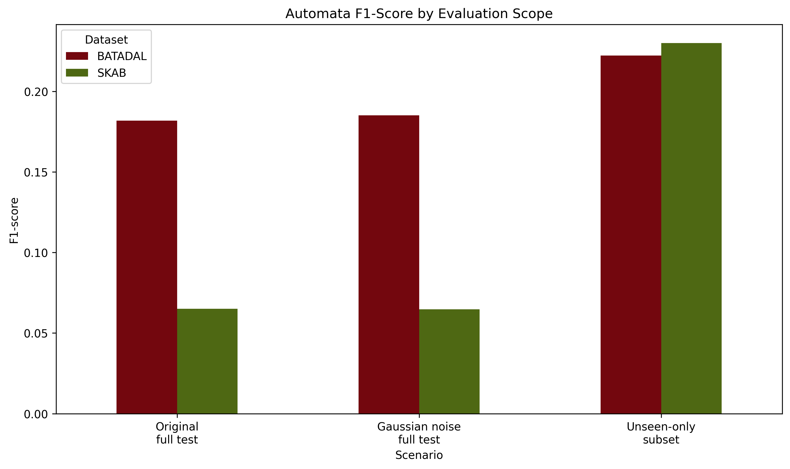

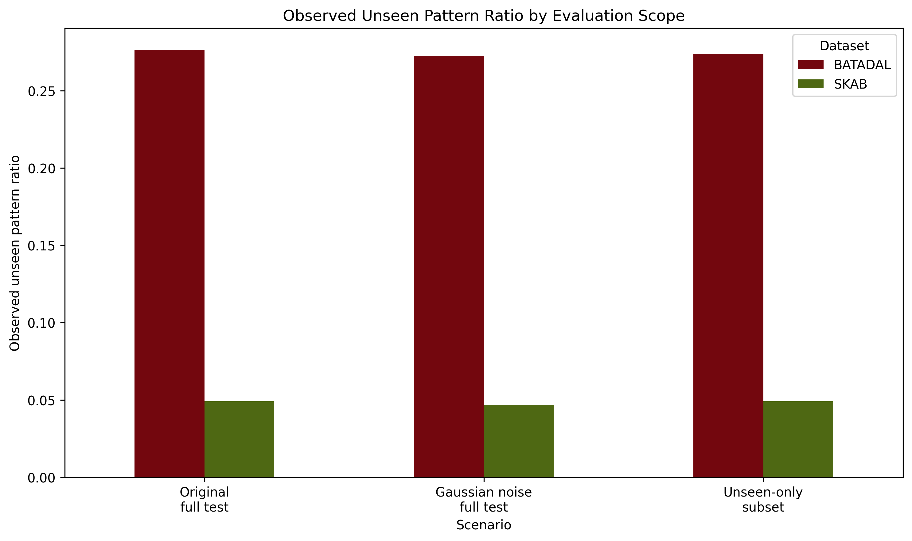

---

### 6.3 Automata Parametre Analizi

Parameter sweep sonuçları, otomata modelinin window size ve alphabet size seçimine duyarlı olduğunu göstermektedir.

| Veri seti | En iyi window | En iyi alphabet |    F1 | Precision | Recall | State count | Transition density |
| --------- | ------------: | --------------: | ----: | --------: | -----: | ----------: | -----------------: |
| BATADAL   |             6 |               5 | 0.257 |     0.154 |  0.763 |       229.0 |             0.0045 |
| SKAB      |             6 |               6 | 0.438 |     0.525 |  0.382 |       125.6 |             0.0095 |

Sabit parametreli modelde performans sınırlı kalsa da, en iyi parametre kombinasyonları ile F1-score değerleri belirgin şekilde artmıştır. Bu durum, otomata modelinin başarısının sembolik temsil kapasitesine ve transition matrix yoğunluğuna bağlı olduğunu göstermektedir.


#### F1-score parameter sweep tabloları

**SKAB F1-score parameter sweep**

| Window \ Alphabet |     3 |     4 |     5 |     6 |
| ----------------- | ----: | ----: | ----: | ----: |
| 3                 | 0.044 | 0.073 | 0.135 | 0.159 |
| 4                 | 0.065 | 0.106 | 0.171 | 0.241 |
| 5                 | 0.093 | 0.116 | 0.186 | 0.322 |
| 6                 | 0.129 | 0.129 | 0.218 | 0.438 |

**BATADAL F1-score parameter sweep**

| Window \ Alphabet |     3 |     4 |     5 |     6 |
| ----------------- | ----: | ----: | ----: | ----: |
| 3                 | 0.146 | 0.164 | 0.163 | 0.179 |
| 4                 | 0.182 | 0.237 | 0.222 | 0.243 |
| 5                 | 0.232 | 0.236 | 0.247 | 0.250 |
| 6                 | 0.197 | 0.224 | 0.257 | 0.239 |

SKAB tarafında en iyi sonuç `window_size=6`, `alphabet_size=6` kombinasyonunda elde edilmiştir. BATADAL tarafında ise en iyi sonuç `window_size=6`, `alphabet_size=5` kombinasyonundadır.

Window size ve alphabet size arttıkça state sayısı artmaktadır. Buna karşılık transition density düşmektedir. Bu durum daha detaylı sembolik temsil ile daha seyrek transition matrix arasında bir trade-off olduğunu göstermektedir.


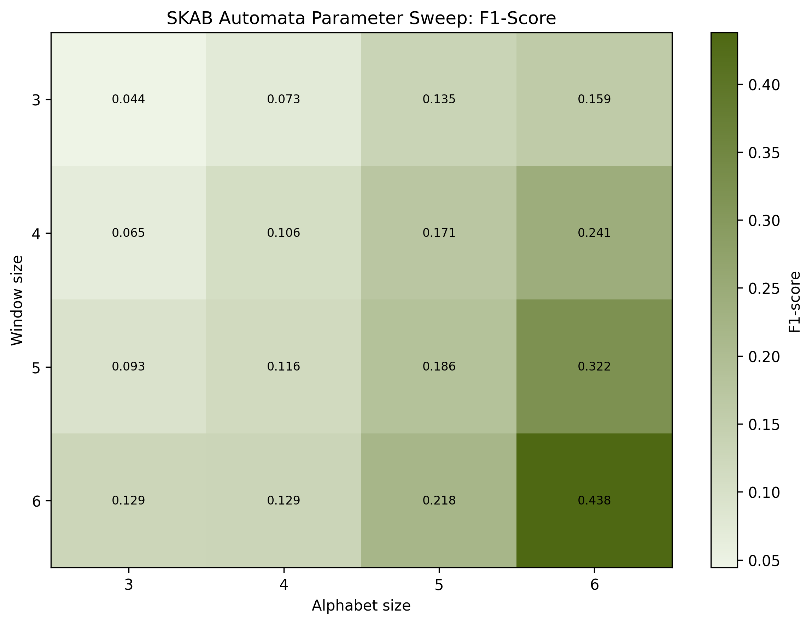

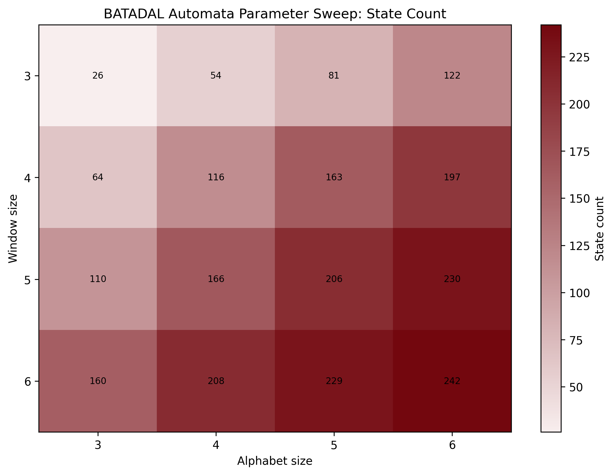

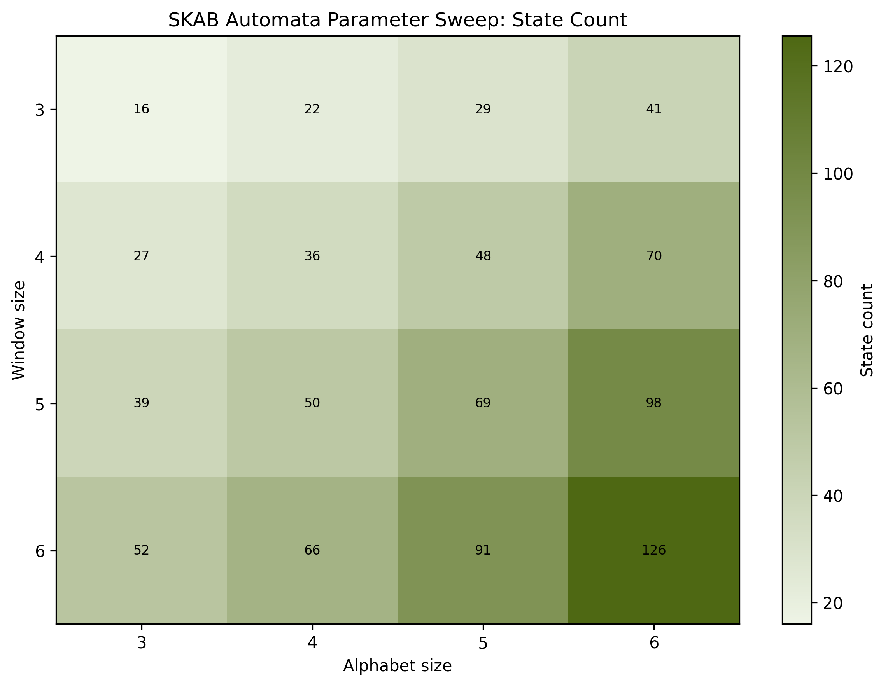

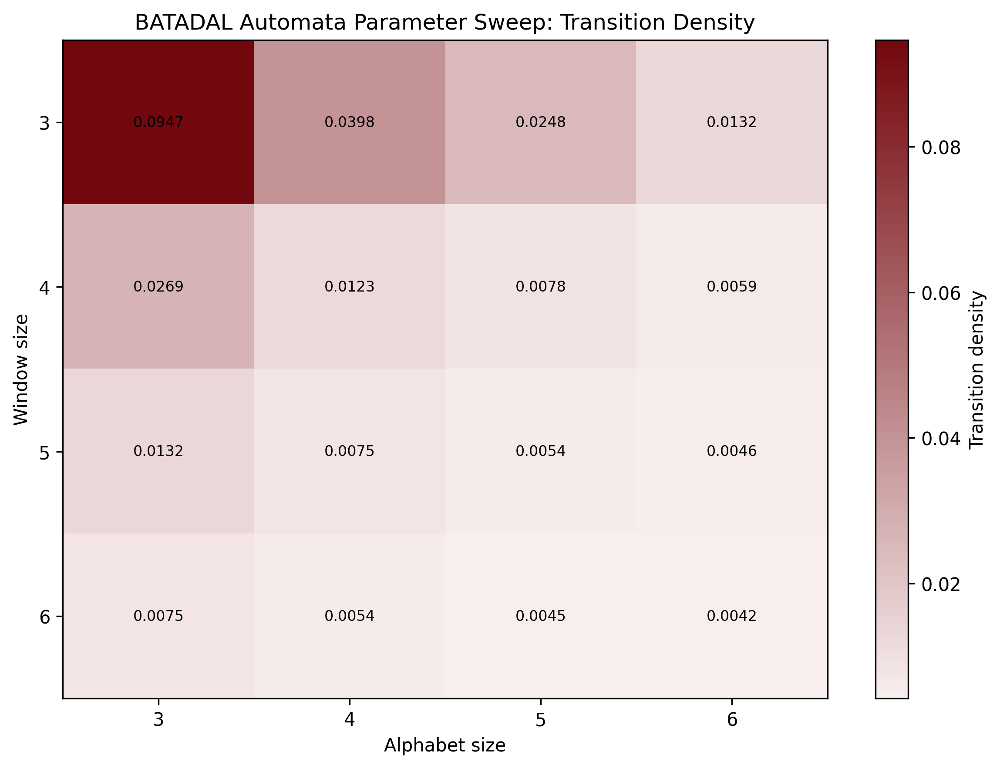

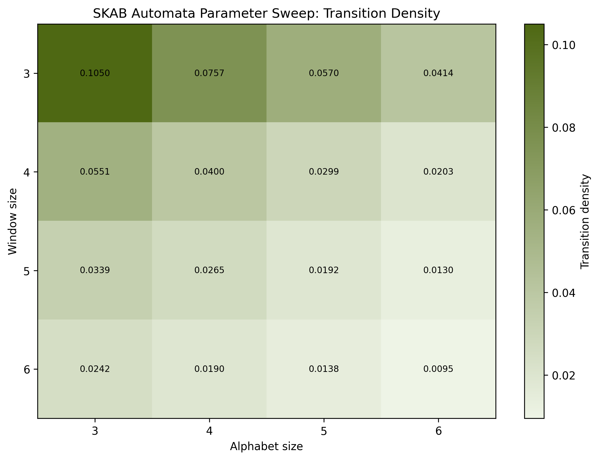

---

### 6.4 Precision-Recall Analizi

Anomali tespiti sınıf dengesizliği içeren bir problem olduğu için accuracy tek başına yeterli değildir. Bu nedenle Precision-Recall eğrileri de incelenmiştir.

BATADAL tarafında Average Precision değerinin no-skill baseline seviyesine yakın veya altında kalması, transition probability tabanlı anomaly score değerlerinin BATADAL veri setinde güçlü bir ayırıcı olmadığını göstermektedir.

SKAB tarafında da Precision-Recall performansı sınırlıdır. Bu sonuç, otomata modelinin fixed parametrelerde anomaly score sıralamasında güçlü olmadığını; ancak parameter sweep ile daha iyi sembolik temsil seçildiğinde F1-score değerinin yükseldiğini göstermektedir.

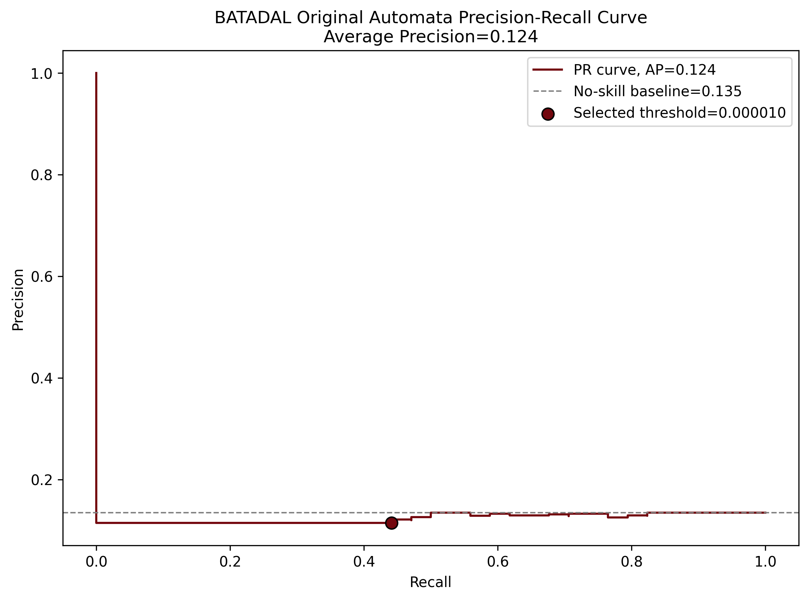

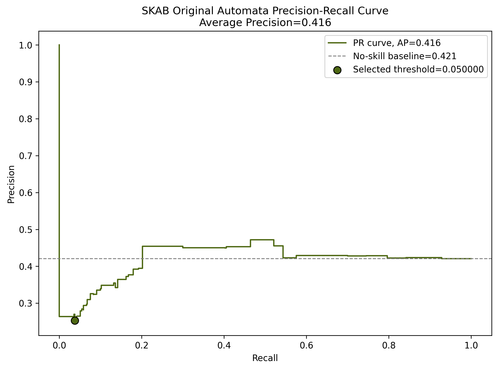

---

### 6.5 İstatistiksel Anlamlılık Testleri

İstatistiksel analizde Wilcoxon signed-rank testi kullanılmıştır. Mevcut sonuçlar aşağıdadır.

| Veri seti | Karşılaştırma        | Test                 | İstatistik |    p-değeri |  n | α=0.05 anlamlı mı? |
| --------- | -------------------- | -------------------- | ---------: | ----------: | -: | ------------------ |
| SKAB      | automata_vs_lstm_f1  | wilcoxon_signed_rank |     0.0000 |      0.0625 |  5 | Hayır              |
| SKAB      | automata_vs_cnn1d_f1 | wilcoxon_signed_rank |     0.0000 |      0.0625 |  5 | Hayır              |
| SKAB      | lstm_vs_cnn1d_f1     | wilcoxon_signed_rank |     5.0000 | 5.96046e-07 | 25 | Evet               |
| BATADAL   | lstm_vs_cnn1d_f1     | wilcoxon_signed_rank |     0.0000 |       0.125 |  5 | Hayır              |

SKAB tarafında LSTM ve 1D-CNN arasındaki fark istatistiksel olarak anlamlı bulunmuştur (`p < 0.05`). Automata ile DL modelleri arasındaki karşılaştırmalarda p-değeri `0.0625` seviyesinde kalmıştır. Bu değer 0.05 eşiğini geçmediği için istatistiksel anlamlılık olarak raporlanmamıştır. Ancak `n=5` gibi küçük eşleşme sayısı, Wilcoxon testinin gücünü sınırlamaktadır.

## 7. Açıklanabilirlik Modülü

Otomata modelinin temel avantajı, her kararın izlenebilir olmasıdır. Model yalnızca `normal` veya `anomaly` kararı üretmez; aynı zamanda karara neden olan state, pattern, transition probability ve confidence bilgilerini verir.

Örnek unseen explanation çıktısı:

```json
{
  "time_step": 10,
  "previous_state": "bccc",
  "pattern": "ccca",
  "status": "unseen",
  "mapped_to": "acca",
  "probability": 1e-06,
  "prediction": 1,
  "true_label": 0,
  "edit_distance": 1,
  "path_probability_so_far": 2.116402116402116e-27,
  "decision": "anomaly",
  "confidence": 2.116402116402116e-27,
  "decision_reason": "low_probability_path"
}
```
Bu açıklama şu bilgileri içerir:

| Alan                      | Açıklama                                           |
| ------------------------- | -------------------------------------------------- |
| `previous_state`          | Modelin bir önceki otomata state’i                 |
| `pattern`                 | Test sırasında gelen örüntü                        |
| `status`                  | Pattern’ın seen/unseen durumu                      |
| `mapped_to`               | Unseen pattern için eşlenen en yakın bilinen state |
| `probability`             | Transition probability veya fallback probability   |
| `edit_distance`           | Levenshtein distance                               |
| `path_probability_so_far` | O ana kadarki kümülatif path probability           |
| `decision`                | Modelin verdiği karar                              |
| `confidence`              | Olasılık tabanlı güven skoru                       |
| `decision_reason`         | Kararın gerekçesi                                  |

Bu yapı sayesinde model yalnızca prediction üretmez; aynı zamanda kararın hangi sembolik geçiş ve hangi olasılık değerleri üzerinden verildiğini gösterir.

Derin öğrenme modelleri genellikle bu düzeyde doğrudan karar gerekçesi üretmez. Bu nedenle otomata yaklaşımı performans açısından sınırlı kalsa bile açıklanabilirlik açısından güçlüdür.

### Transition probability görselleri

Transition probability heatmap, state'ler arasındaki geçiş olasılıklarını gösterir. Çok sayıda sıfır veya düşük değer görülmesi normaldir; bu, transition matrix'in seyrek yapıda olduğunu gösterir.

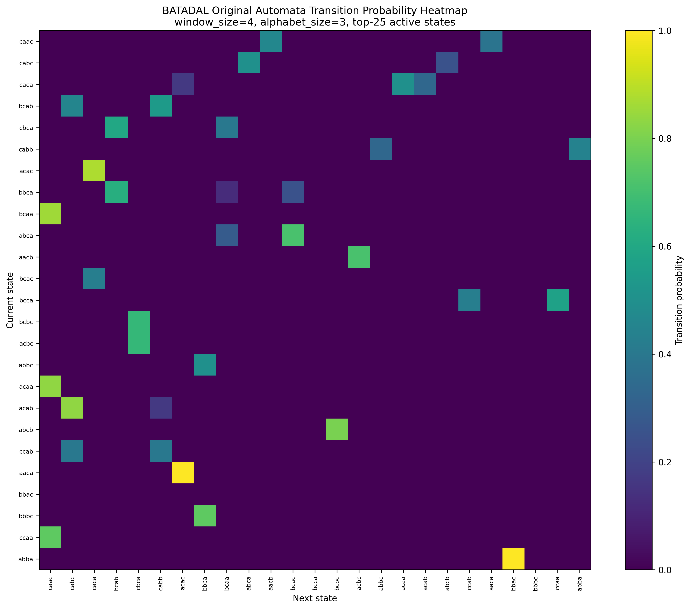

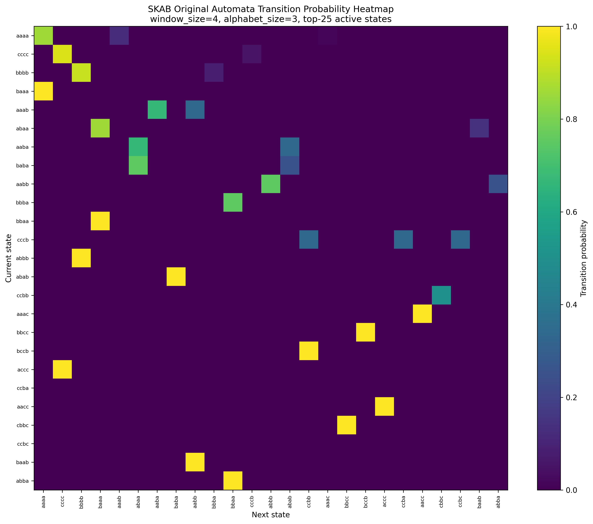

State transition graph ise en güçlü geçişlerin görsel olarak incelenmesini sağlar.


### Precision-Recall analizi

Otomata modeli düşük transition probability değerlerini anomaly sinyali olarak kullandığı için anomaly score şu şekilde hesaplanmıştır:

```txt
anomaly_score = 1 - transition_probability
```

PR curve grafiklerinde no-skill baseline ve seçilen threshold noktası gösterilmiştir.


BATADAL'da Average Precision değerinin no-skill baseline seviyesine yakın veya altında kalması, transition-probability tabanlı anomaly score'un bu veri setinde güçlü bir sıralama skoru üretmediğini göstermektedir. SKAB tarafında da original fixed ayarda recall düşük kalmıştır. Bu nedenle otomata modelinin predictive performance açısından sınırlı; açıklanabilirlik açısından güçlü olduğu sonucuna varılmıştır.

---

## 8. Genel Değerlendirme

Bu projede iki farklı model ailesi farklı güçlü ve zayıf yönler göstermiştir.

### 8.1 Derin öğrenme modelleri

Derin öğrenme modelleri, özellikle SKAB veri setinde yüksek F1-score üretmiştir. SKAB üzerinde LSTM `0.850 ± 0.082`, 1D-CNN ise `0.798 ± 0.120` F1 değerine ulaşmıştır. Bu sonuçlar, DL modellerinin çok değişkenli zaman serisi örüntülerini doğrudan kullanabildiğini göstermektedir.

BATADAL tarafında DL sonuçları daha dengesizdir. LSTM `0.227 ± 0.312` F1 elde ederken 1D-CNN tüm seed'lerde anomaly sınıfını yakalayamamış ve F1 `0.000` kalmıştır. Bu durum BATADAL'daki sınıf dengesizliği ve veri seti karakteristiğinin DL modellerini zorladığını göstermektedir.

### 8.2 Otomata modeli

Otomata modeli sabit parametrelerde yüksek sınıflandırma performansı üretmemiştir. Ancak parameter sweep sonucunda daha uygun window/alphabet kombinasyonları ile performans artmıştır:

- BATADAL: `0.182` -> `0.257`
- SKAB: `0.077` -> `0.438`

Bu durum otomata modelinin başarısının sembolik temsil kapasitesine ve transition matrix yoğunluğuna duyarlı olduğunu göstermektedir.

Otomata modelinin temel avantajı, karar sürecini açıkça raporlayabilmesidir. Derin öğrenme modelleri daha yüksek performans üretebilse de, kararın hangi state-transition yoluna dayandığını göstermez. Otomata ise state, transition probability, unseen mapping ve confidence score üretir.


### 8.3 Sonuç

Yüksek predictive performance öncelikli olduğunda SKAB üzerinde DL modelleri daha avantajlıdır. Ancak açıklanabilirlik, denetlenebilirlik ve karar yolunun izlenebilirliği öncelikli olduğunda olasılıksal otomata anlamlı bir alternatif sunmaktadır. BATADAL tarafında her iki yaklaşım da zorlanmıştır; bu durum veri seti karakteristiğinin model performansı üzerinde güçlü etkisi olduğunu göstermektedir.

---

## 9. Nasıl Çalıştırılır?

### 9.1 Sanal ortam oluşturma

Python 3.11 önerilir.

```powershell
py -3.11 -m venv .venv
.\.venv\Scriptsctivate
python -m pip install --upgrade pip
python -m pip install -r requirements.txt
```

PyTorch eksikse CPU kurulumu için:

```powershell
python -m pip install torch torchvision torchaudio --index-url https://download.pytorch.org/whl/cpu
```

### 9.2 Veri setlerini yerleştirme

Beklenen yapı:

```txt
data/
  raw/
    batadal/
      training_dataset_2/
        BATADAL_dataset04.csv
    skab/
      valve1/
        *.csv
      valve2/
        *.csv
```

### 9.3 Veri seti kontrolü

```powershell
python -m src.data.inspect_datasets
```

### 9.4 Otomata pipeline

Tüm otomata deneyleri, özet tablolar, grafikler ve testler tek komutla üretilebilir:

```powershell
python -m src.experiments.run_full_automata_pipeline
```

Bu komut aşağıdaki çıktıları üretir:

```txt
reports/results/*.json
reports/results/*.csv
reports/figures/*.png
reports/tables/*.csv
```

### 9.5 Derin öğrenme deneyleri

Derin öğrenme deneylerini çalıştırmak için:

```powershell
python -m src.experiments.run_dl_experiments
```

DL sonuçlarını özetlemek için:

```powershell
python -m src.experiments.summarize_dl_results
```

### 9.6 İstatistiksel analiz

```powershell
python -m src.experiments.run_statistical_analysis
```

### 9.7 Testler

```powershell
python -m pytest
```

---

## 10. Proje Yapısı

```txt
yazlab2-timeseries-automata/
│
├── config.yaml
├── requirements.txt
├── README.md
│
├── data/
│   └── raw/
│       ├── batadal/
│       └── skab/
│
├── src/
│   ├── config/
│   ├── data/
│   ├── preprocessing/
│   ├── models/
│   │   ├── automata/
│   │   ├── lstm_model.py
│   │   ├── cnn1d_model.py
│   │   └── train_deep_learning.py
│   ├── evaluation/
│   ├── experiments/
│   └── visualization/
│
├── tests/
│
└── reports/
    ├── results/
    ├── figures/
    └── tables/
```

---

## 11. Önemli Çıktı Dosyaları

### Otomata

```txt
reports/results/automata_summary_results.csv
reports/results/automata_multiseed_summary.csv
reports/results/automata_best_parameter_summary.csv
reports/results/automata_parameter_sweep_batadal.csv
reports/results/automata_parameter_sweep_skab.csv
```

### Derin öğrenme

```txt
reports/results/deep_learning/dl_training_summary.json
reports/results/deep_learning/dl_evaluation_metrics.json
reports/tables/deep_learning/dl_summary.csv
```

### İstatistiksel analiz

```txt
reports/results/statistical_analysis_results.json
reports/tables/statistical_analysis_summary.csv
```

### Öne çıkan görseller

```txt
reports/figures/automata_fixed_vs_best_parameter_f1.png
reports/figures/automata_multiseed_f1_errorbars.png
reports/figures/automata_parameter_f1_heatmap_batadal.png
reports/figures/automata_parameter_f1_heatmap_skab.png
reports/figures/automata_transition_heatmap_batadal.png
reports/figures/automata_transition_heatmap_skab.png
reports/figures/pr_curve_batadal_original.png
reports/figures/pr_curve_skab_original.png
reports/figures/deep_learning/.../confusion_matrix.png
reports/figures/deep_learning/.../precision_recall_curve.png
reports/figures/deep_learning/.../roc_curve.png
```

---

## 12. Sınırlılıklar

1. Otomata modelinde PCA ile tek boyutlu temsil kullanılması bilgi kaybına yol açabilir.
2. PAA ve SAX dönüşümleri yorumlanabilir sembolik yapı sağlasa da ince sensör değişimlerini kaybettirebilir.
3. BATADAL üzerinde hem otomata hem DL modelleri sınıf dengesizliği ve veri karakteristiği nedeniyle zorlanmıştır.
4. Unseen-only sonuçları full-test sonuçlarıyla doğrudan karşılaştırılmamalıdır.
5. Bu zip içinde runtime için sayısal süre ölçümü bulunmadığından runtime analizi nitel olarak verilmiştir.
6. DL tarafında bu sürümde LSTM ve 1D-CNN modelleri bulunmaktadır; GRU çıktısı mevcut değildir.

---

## 13. Kısa Sonuç

Bu proje, zaman serisi anomali tespitinde derin öğrenme ve olasılıksal otomata yaklaşımlarının farklı avantajlara sahip olduğunu göstermektedir. Derin öğrenme modelleri özellikle SKAB üzerinde daha yüksek F1-score üretmiştir. Olasılıksal otomata modeli ise daha düşük performansına rağmen karar sürecini state, transition probability, unseen mapping ve confidence score üzerinden açıklayabildiği için yorumlanabilirlik açısından güçlüdür.


