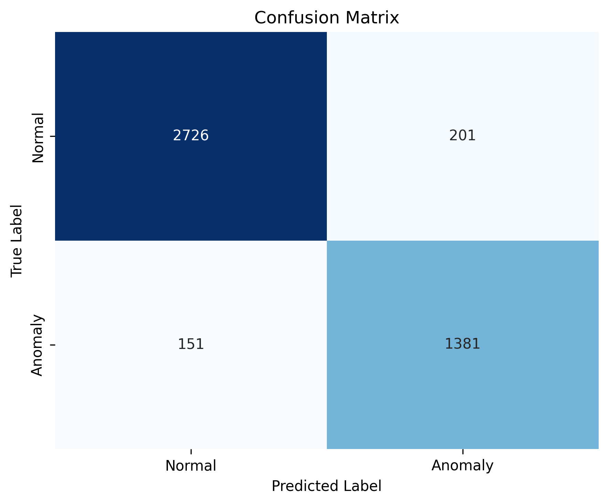
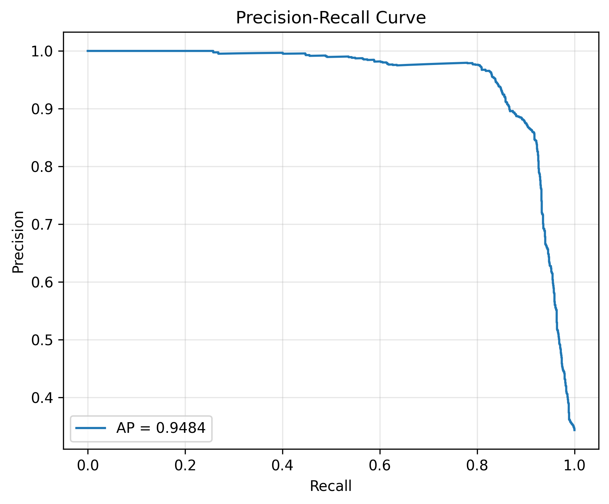
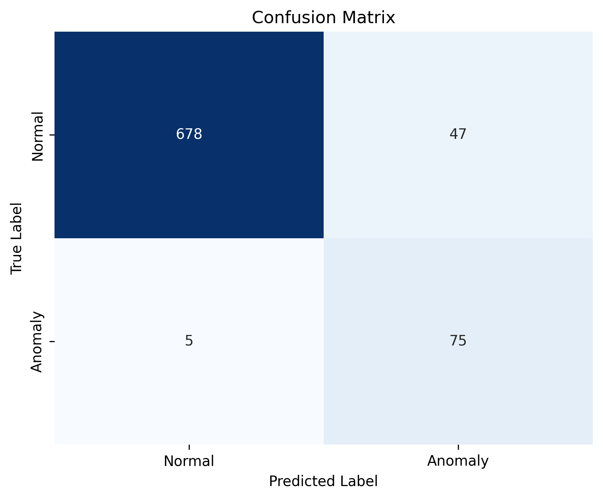
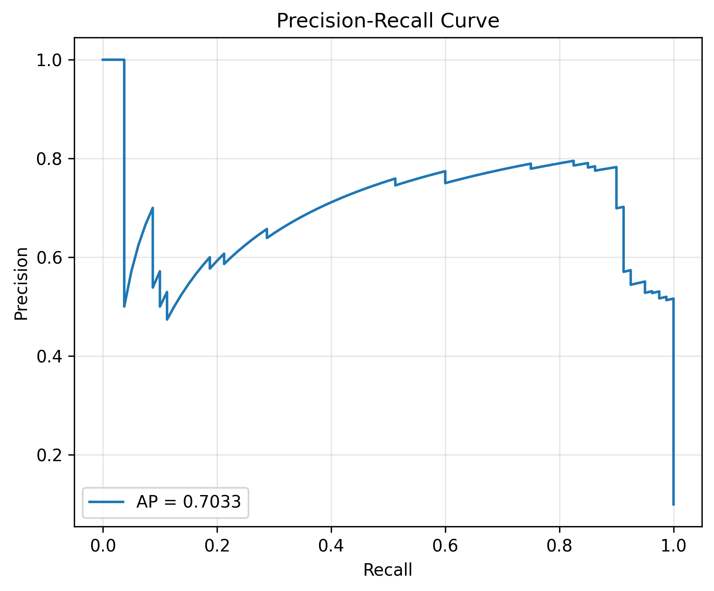
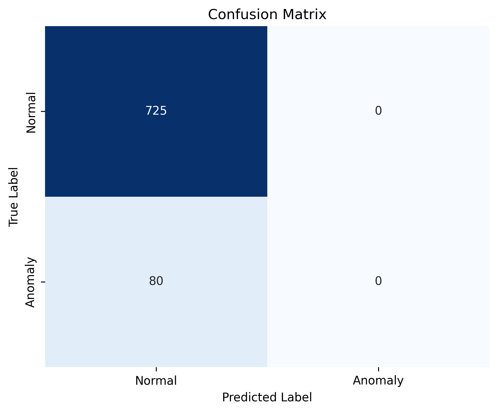
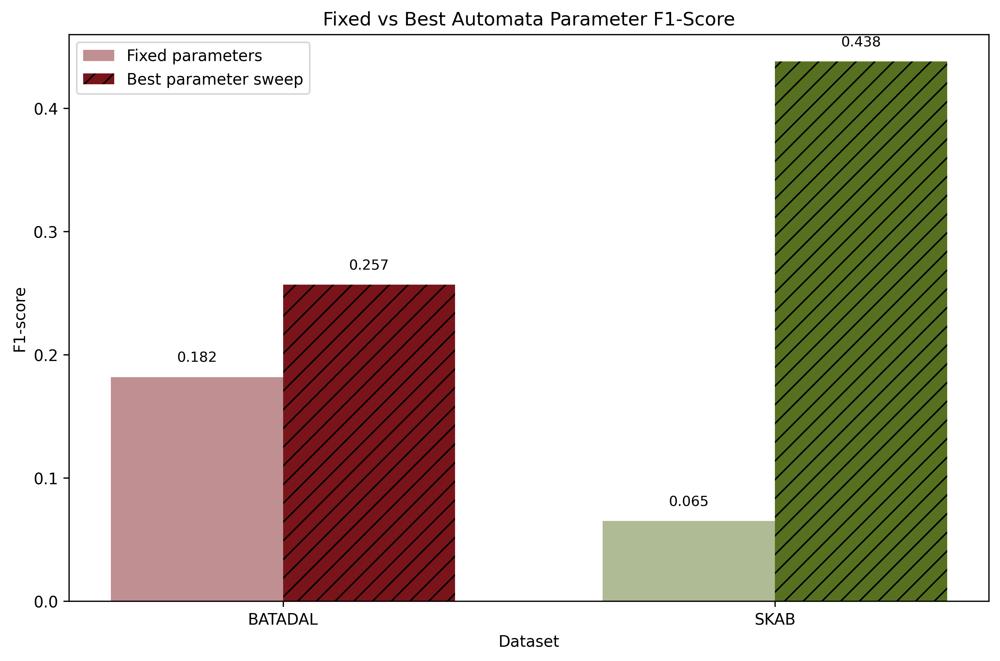
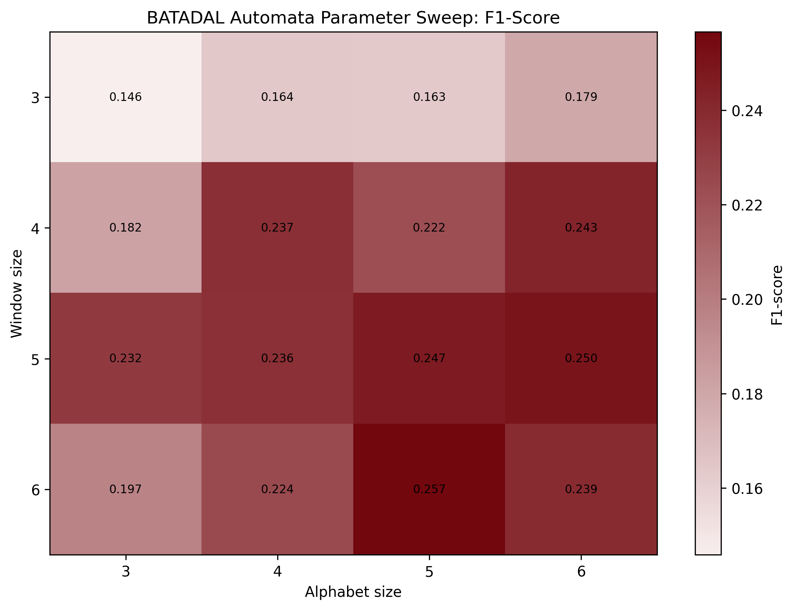
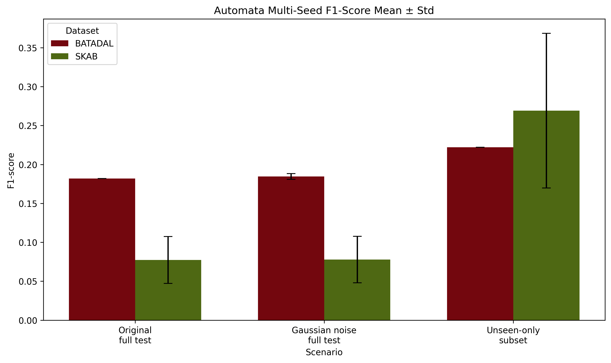
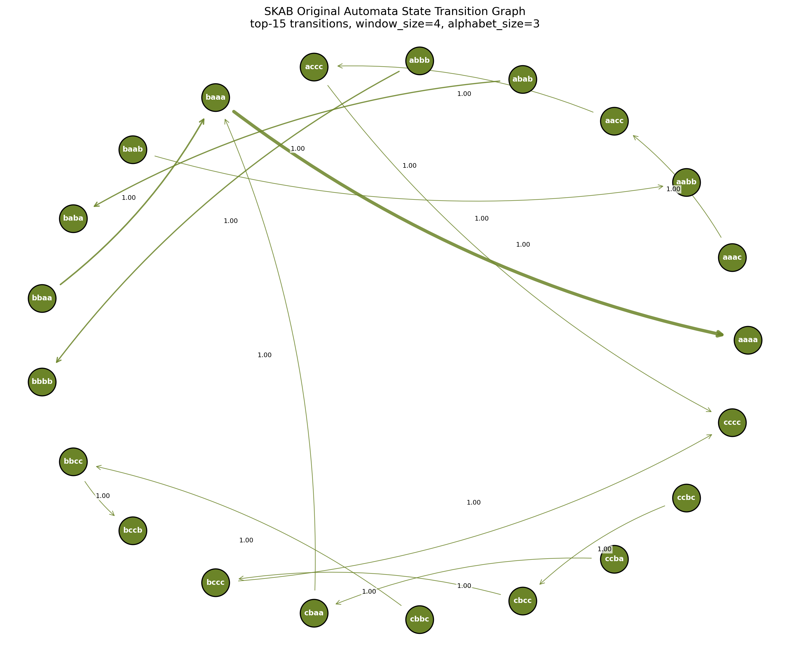
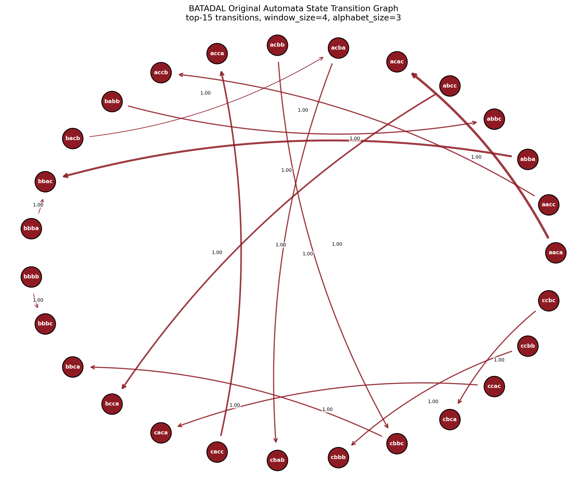

# Explainable Anomaly Detection in Industrial Time Series

Deep Learning vs. Probabilistic Automata for anomaly detection in industrial sensor data.

This repository compares two fundamentally different approaches to anomaly detection in industrial time series:

1. **Black-box deep learning models** — LSTM and 1D-CNN.
2. **An explainable probabilistic automata model** — PCA, PAA, SAX symbolic encoding, sliding-window pattern extraction, transition probabilities, and Levenshtein-distance-based handling of unseen patterns.

The goal is not simply to maximize accuracy. The point is to compare the raw predictive power of deep learning against a model that can explain, step by step, why it labeled a given point as anomalous.

## Key Findings

On SKAB, deep learning clearly outperforms the automata model. The best result is an F1-score of `0.859` from the LSTM model; 1D-CNN is also strong at `0.822 ± 0.064`.

On BATADAL, deep learning is a mixed picture. LSTM reaches `0.474 ± 0.434` F1 with class-weighted loss and a validation-tuned threshold (up from `0.227 ± 0.312` with a plain unweighted loss and a fixed 0.5 threshold). 1D-CNN still reports an F1-score of `0.000` on every seed even after the same fix — its training logs show validation loss is already at its lowest right after epoch 1, and its precision-recall curve gives an average precision of roughly `0.057`, below the dataset's own ~10% anomaly rate. In other words, the model's raw scores carry essentially no anomaly signal on this dataset, so no choice of threshold can fix it; this is a distinct, disclosed limitation (see [Interpretation](#interpretation)).

With its fixed parameters, the automata model produces a low F1-score on both datasets; tuning `window_size` and `alphabet_size` improves it substantially:

| Dataset | Fixed-Parameter Automata F1 | Best Automata F1 | Best Parameters |
|---|---:|---:|---|
| BATADAL | 0.182 | 0.257 | `window_size=6`, `alphabet_size=5` |
| SKAB | 0.083 ± 0.070 | 0.337 ± 0.144 | `window_size=6`, `alphabet_size=6` |

Even where its raw score is lower than deep learning, the automata model can justify its decisions through explicit state transitions, transition probabilities, unseen-pattern mapping, and a confidence score — something the neural models cannot natively provide.

## What This Project Does

This is a **time series anomaly detection** project. A time series is a sequence of measurements recorded in order over time — for example, the temperature, pressure, current, or vibration of a machine sampled every second.

An anomaly is a deviation from a system's normal behavior. In industrial systems this can mean a fault, a cyber attack, sensor degradation, a valve problem, a pressure leak, or unexpected operational behavior.

The project answers two separate questions:

1. How well do deep learning models detect these anomalies?
2. Can the automata model explain its decisions in an understandable way, even if its raw score is lower?

## Datasets

### SKAB

SKAB contains sensor readings from an industrial test rig. Only the `valve1` and `valve2` subsets are used here. Each row carries `source_group` and `source_file` metadata columns so that its origin can be traced; these columns are excluded from the model input and used only for splitting and lineage tracking.

| Property | Value |
|---|---:|
| Rows | 22472 |
| Features | 8 |
| Target column | `anomaly` |
| Normal samples | 14646 |
| Anomalous samples | 7826 |
| Source files used | 20 |

Sensor columns used from SKAB:

| Column | Meaning |
|---|---|
| `Accelerometer1RMS` | RMS vibration from the first accelerometer. |
| `Accelerometer2RMS` | RMS vibration from a second accelerometer at a different point. |
| `Current` | Electrical current draw; can indicate motor or system faults. |
| `Pressure` | Pressure reading; sensitive to valve or flow problems. |
| `Temperature` | Temperature reading. |
| `Thermocouple` | Temperature from a second sensor type. |
| `Voltage` | Supply/operating voltage. |
| `Volume Flow RateRMS` | RMS volumetric flow rate. |

SKAB is split by group rather than randomly. Rows from the same source CSV never appear in both the train and test sets, which prevents leakage across the split.

### BATADAL

BATADAL is a water distribution system dataset used for cyber-attack / anomaly detection. This project uses `Training Dataset 2`. The `DATETIME` column is used only to preserve temporal order and is excluded from the model input. The target column is `ATT_FLAG`.

| Property | Value |
|---|---:|
| Rows | 4177 |
| Features | 43 |
| Target column | `ATT_FLAG` |
| Time column | `DATETIME` |
| Normal samples | 3958 |
| Anomalous samples | 219 |
| Train rows | 2506 |
| Validation rows | 835 |
| Test rows | 836 |

BATADAL is highly imbalanced — far more normal samples than anomalies (~5%) — so a model that always predicts "normal" can still score a high accuracy, and a small training set makes it easy for a model to overfit within a handful of epochs. Both effects show up directly in the deep learning results below.

BATADAL is split chronologically:

```text
60% train -> 20% validation -> 20% test
```

A random split is not used, since future data leaking into training would produce unrealistically optimistic results for a time series problem.

### Data provenance and licensing

Both raw datasets are included in `data/raw/` so the project can be cloned and run end to end without external downloads.

- **SKAB** — Skoltech Anomaly Benchmark, [waico/SKAB](https://github.com/waico/SKAB), distributed under **GPL-3.0**. The raw CSV files retain this license.
- **BATADAL** — from the [BATtle of the Attack Detection Algorithms](https://www.batadal.net/data.html), distributed under **CC BY 4.0**. Attribution: Taormina, R. et al., "The Battle of the Attack Detection Algorithms," *Journal of Water Resources Planning and Management*, 2018.

The code in this repository is licensed separately (see [LICENSE](LICENSE)); the two dataset licenses above apply specifically to the files under `data/raw/`.

## Glossary

| Term | Meaning in this project |
|---|---|
| Time series | Sensor measurements ordered by time. |
| Feature | An input variable given to the model, e.g. pressure, temperature, current. |
| Target / Label | The class the model predicts. Here, `0 = normal`, `1 = anomaly`. |
| Anomaly | A deviation from normal system behavior. |
| Train set | The portion of data the model learns from. |
| Validation set | An intermediate split used for parameter/threshold selection. |
| Test set | The held-out split used for final performance measurement. |
| Data leakage | Test information leaking into training, producing overly optimistic results. |
| Accuracy | Fraction of correct predictions; misleading alone on imbalanced data. |
| Precision | Of everything the model calls "anomaly," how much actually is. |
| Recall | Of all real anomalies, how many were caught. |
| F1-score | Harmonic mean of precision and recall; central metric for anomaly detection. |
| Average precision (AP) | Area under the precision-recall curve; summarizes ranking quality across all thresholds. |
| Class weighting | Upweighting the minority class in the loss function so it isn't ignored under imbalance. |
| LSTM | A recurrent deep learning model that can learn temporal dependencies. |
| 1D-CNN | A convolutional model that captures local patterns within a time window. |
| Sliding window | Splitting a time series into fixed-length consecutive segments. |
| PCA | Dimensionality reduction; the automata pipeline uses the first principal component (PC1). |
| PAA | Piecewise Aggregate Approximation — averages a time series over fixed segments. |
| SAX | Symbolic Aggregate approXimation — converts a numeric series into symbols (e.g. `a`, `b`, `c`). |
| Alphabet size | Number of distinct symbols used by SAX. |
| Window size | Number of symbols that form one state/pattern. |
| State | A symbolic pattern in the automata, e.g. `abca`. |
| Transition | A move from one state to another. |
| Transition probability | How likely a given transition was in the training data. |
| Transition density | Fraction of all possible transitions that were actually observed. |
| Unseen pattern | A pattern that never appeared during training but occurs at test time. |
| Levenshtein distance | Edit distance between two symbolic sequences. |
| Confidence score | The automata model's probability-based confidence in a decision. |

## Methodology

### Deep Learning Pipeline

Two deep learning models are used:

| Model | Why it was chosen |
|---|---|
| LSTM | Can learn how past measurements influence future behavior. |
| 1D-CNN | Captures short, local patterns within a time window. |

Pipeline:

```text
Raw sensor data
-> separate target/metadata columns
-> fit normalization on train only
-> transform validation/test with the fitted scaler
-> build sliding-window sequences
-> train LSTM and 1D-CNN with a class-weighted loss (pos_weight from the
   training split's class ratio, so the minority anomaly class is not ignored)
-> tune the classification threshold on the validation split (maximize F1)
   instead of using a fixed 0.5 cut
-> accuracy, precision, recall, F1, confusion matrix, PR/ROC curves on test
```

Deep learning settings:

| Setting | Value |
|---|---:|
| Sequence length | 32 |
| Batch size | 32 |
| Max epochs | 50 |
| Early stopping patience | 5 |
| Random seeds | 42, 123, 2026, 7, 999 |
| Class weighting | `pos_weight` = negative/positive ratio in the training split |
| Threshold selection | Best F1-score threshold on the validation split, from a 0.05–0.95 grid |

SKAB uses 5 group folds and 5 seeds, so each model is summarized over 25 runs. BATADAL uses a single chronological split with 5 seeds, so each model is summarized over 5 runs.

### Automata Pipeline

The automata model does not learn directly from the raw multivariate sensor matrix. The data is first converted into a symbolic time series:

```text
Multivariate sensor data
-> standard scaling
-> PCA to extract PC1
-> PAA segment averaging
-> SAX symbolic encoding
-> sliding-window pattern extraction
-> pattern = state
-> transition probability estimation
-> low-probability transition = anomaly candidate
```

Core assumption:

```text
Frequent transitions in training -> normal behavior
Rare or unseen transitions in training -> anomaly candidate
```

Fixed automata parameters:

| Parameter | Value |
|---|---:|
| `window_size` | 4 |
| `alphabet_size` | 3 |
| `paa_segments` | 256 |
| `fallback_probability` | 0.000001 |
| `anomaly_threshold` | 0.05 |

Parameter sweep range:

```text
window_size:   3, 4, 5, 6
alphabet_size: 3, 4, 5, 6
```

### Unseen Pattern Handling

If a pattern never seen during training appears at test time, the model must not fail. Instead, Levenshtein distance is used to find the closest known state:

```text
Incoming unseen pattern: ccca
Closest known state:     acca
Edit distance:           1
```

The transition probability and decision are then derived from this mapped state, which lets the automata model justify its predictions rather than simply emitting them.

## Experiment Design

| Aspect | Decision |
|---|---|
| Datasets | 2: SKAB and BATADAL |
| DL models | 2: LSTM and 1D-CNN |
| Split strategy | SKAB: group split · BATADAL: chronological 60/20/20 |
| Scenarios | Original, Gaussian noise, unseen-only |
| Automata parameters | Fixed setting + window/alphabet sweep |
| Statistical test | Wilcoxon signed-rank |
| Figures | Confusion matrix, precision-recall curve, parameter heatmap, transition heatmap, transition graph |

A train-on-one-dataset / test-on-the-other cross-dataset transfer experiment was not performed; SKAB and BATADAL were evaluated independently, and this is noted as a limitation below.

## Environment and Runtime

| Pipeline | Environment | Measured runtime |
|---|---|---:|
| Deep learning full training (`run_dl_experiments`) | CPU-only, Intel Core Ultra 5 125H, Python 3.13.3 | 19 min 42 sec |
| Automata full experiment suite | Same machine | a few minutes (lightweight symbolic pipeline, no neural network training) |

Both models train on CPU only; the code selects CUDA if available and falls back to CPU otherwise (`torch.cuda.is_available()`), so runtime will vary with hardware.

Smoke-test outputs are kept separate from final training outputs. Smoke tests only confirm that the code runs; the reported results below come from the full experiment runs.

**Reproducibility note:** the automata pipeline's SKAB split uses `StratifiedGroupKFold`, whose fold assignment can differ across `scikit-learn` versions even with the exact same seed. `requirements.txt` pins exact versions; the SKAB automata numbers in this README were generated and verified against those pinned versions. The deep learning numbers above were produced with the pinned `torch==2.6.0` and the same pinned `scikit-learn` version (BATADAL's split does not depend on `scikit-learn`; SKAB's DL split uses the same grouped-fold strategy as the automata pipeline).

## Deep Learning Results

| Dataset | Model | Runs | Accuracy | Precision | Recall | F1-score |
|---|---:|---:|---:|---:|---:|---:|
| BATADAL | 1D-CNN | 5 | 0.890 ± 0.003 | 0.000 ± 0.000 | 0.000 ± 0.000 | 0.000 ± 0.000 |
| BATADAL | LSTM | 5 | 0.932 ± 0.031 | 0.449 ± 0.420 | 0.513 ± 0.471 | 0.474 ± 0.434 |
| SKAB | 1D-CNN | 25 | 0.882 ± 0.037 | 0.879 ± 0.091 | 0.792 ± 0.125 | 0.822 ± 0.064 |
| SKAB | LSTM | 25 | 0.908 ± 0.042 | 0.924 ± 0.077 | 0.813 ± 0.110 | 0.859 ± 0.000 |

### Interpretation

On SKAB, LSTM is the strongest model — both precision and recall are high, which drives its F1-score up. 1D-CNN is also strong and close behind.

On BATADAL, class weighting and threshold tuning (see Methodology) made a real difference for LSTM but not for 1D-CNN, and the two failure modes are different:

- **Before the fix**, both models effectively ignored the anomaly class: with an unweighted loss and a fixed 0.5 threshold, 1D-CNN scored accuracy ≈ 0.90 with F1 = 0.000, and LSTM only reached F1 = 0.227 ± 0.312 (highly inconsistent across seeds).
- **After the fix**, LSTM improved substantially (F1 = 0.474 ± 0.434). At seed 42 specifically, LSTM's confusion matrix shows 75 of 80 real anomalies correctly caught, with a precision-recall curve giving an average precision of 0.68 — a real, usable detector.
- **1D-CNN still reports F1 = 0.000 on every seed.** This is no longer explained by class imbalance or a fixed threshold — both are now addressed. The training logs show why: for every seed, validation loss is already at its minimum right after epoch 1 and gets worse every epoch after that, so early stopping keeps an almost-untrained model. Its precision-recall curve confirms this: average precision is about 0.057, actually *below* the dataset's ~10% test-set anomaly rate (i.e. worse than randomly ranking samples). In short, on BATADAL, 1D-CNN's raw scores carry no separable anomaly signal at any threshold; this looks like a genuine data-scarcity / architecture-fit limitation (BATADAL's training split has only ~2,500 rows before windowing) rather than something threshold tuning or class weighting can resolve.












The last two figures are the clearest illustration in this project of why a single accuracy number is not enough: 1D-CNN's confusion matrix shows it never predicting the anomaly class, and its precision-recall curve shows this is not a threshold problem — the curve itself carries almost no signal.

Overall message:

```text
Deep learning performed strongly on SKAB. On BATADAL, class weighting and
threshold tuning rescued LSTM (F1 0.227 -> 0.474) but did not rescue 1D-CNN,
whose scores carry no usable anomaly signal on this dataset regardless of
threshold. Accuracy alone is never sufficient -- F1-score, the confusion
matrix, and the precision-recall curve should be read together.
```

Deep learning is the stronger predictor, particularly on SKAB, but it cannot explain its decisions the way the automata model can through state transitions and probabilities. In this project, deep learning represents "high predictive performance" (with real, seed-dependent limits on BATADAL) and the automata model represents "explainable decision-making."

## Automata Results

### Fixed-Parameter Scenario Results

| Dataset | Scenario | Accuracy | Precision | Recall | F1-score | Unseen ratio |
|---|---|---:|---:|---:|---:|---:|
| BATADAL | original | 0.464 | 0.115 | 0.441 | 0.182 | 0.277 |
| BATADAL | gaussian_noise | 0.474 ± 0.013 | 0.117 ± 0.003 | 0.441 ± 0.000 | 0.185 ± 0.004 | 0.271 ± 0.005 |
| BATADAL | unseen_only | 0.290 | 0.135 | 0.636 | 0.222 | 0.274 |
| SKAB | original | 0.548 ± 0.010 | 0.230 ± 0.129 | 0.054 ± 0.050 | 0.083 ± 0.070 | 0.050 ± 0.019 |
| SKAB | gaussian_noise | 0.549 ± 0.009 | 0.235 ± 0.128 | 0.056 ± 0.046 | 0.086 ± 0.066 | 0.049 ± 0.017 |
| SKAB | unseen_only | 0.366 ± 0.121 | 0.212 ± 0.180 | 0.490 ± 0.224 | 0.276 ± 0.209 | 0.050 ± 0.020 |

`unseen_only` should not be compared directly against the full test set results. It isolates only the subset of patterns that were never seen during training, so it should be read as "how does the unseen-handling mechanism behave?" rather than "is this scenario better or worse?"


### Noise Sensitivity

Gaussian noise does not cause a large drop in F1-score on either dataset:

| Dataset | Original F1 | Gaussian Noise F1 | Note |
|---|---:|---:|---|
| BATADAL | 0.182 | 0.185 ± 0.004 | Low-level noise did not hurt performance. |
| SKAB | 0.083 ± 0.070 | 0.086 ± 0.066 | Effect of noise stayed limited; run-to-run variance across seeds is itself larger than the noise effect. |

This is because the PAA and SAX transformations partially smooth small numeric changes at the symbolic level — a small sensor perturbation does not always flip a value to a different symbol.

### Parameter Analysis

Automata performance is highly sensitive to `window_size` and `alphabet_size`.

| Dataset | Best Window | Best Alphabet | Accuracy | Precision | Recall | F1-score | State Count | Transition Density |
|---|---:|---:|---:|---:|---:|---:|---:|---:|
| BATADAL | 6 | 5 | 0.328 | 0.154 | 0.763 | 0.257 | 229.0 | 0.0045 |
| SKAB | 6 | 6 | 0.522 ± 0.047 | 0.452 ± 0.065 | 0.292 ± 0.149 | 0.337 ± 0.144 | 125.8 | 0.0096 |

Increasing `window_size` gives each state a longer symbolic context. For example, `window_size=3` produces a short pattern like `abc`, while `window_size=6` produces longer, more distinctive states. Both datasets achieve their best results at `window_size=6`.

Increasing `alphabet_size` gives SAX a finer symbolic resolution. For example, `alphabet_size=3` only uses `a, b, c`, while `alphabet_size=6` allows finer distinctions. SKAB's best result uses `alphabet_size=6`. BATADAL peaks at `alphabet_size=5`; at `6`, the state space becomes too sparse and F1 drops slightly.

Final parameter choice:

| Dataset | Preferred Window | Preferred Alphabet | Rationale |
|---|---:|---:|---|
| SKAB | 6 | 6 | Longer context and finer symbolic resolution clearly improved F1. |
| BATADAL | 6 | 5 | Longer context helped, but alphabet size 6 produced an overly sparse transition structure, so 5 was more balanced. |








## Explainability

The automata model's main advantage is that it produces traceable information for every decision. A deep learning model typically returns only a score or class label; the automata model can show exactly which state transition drove a given decision.

Example unseen-pattern explanation output:

```json
{
  "time_step": 10,
  "previous_state": "bccc",
  "pattern": "ccca",
  "status": "unseen",
  "mapped_to": "acca",
  "probability": 1e-06,
  "prediction": 1,
  "true_label": 0,
  "edit_distance": 1,
  "path_probability_so_far": 2.116402116402116e-27,
  "decision": "anomaly",
  "confidence": 2.116402116402116e-27,
  "decision_reason": "low_probability_path"
}
```

Field reference:

| Field | Meaning |
|---|---|
| `previous_state` | The model's previous symbolic state. |
| `pattern` | The new pattern observed at test time. |
| `status` | Whether the pattern was seen during training. |
| `mapped_to` | The closest known state, found via Levenshtein distance, for an unseen pattern. |
| `probability` | The transition probability used for this step. |
| `edit_distance` | The distance between the incoming pattern and its mapped state. |
| `path_probability_so_far` | The combined probability of the path up to this point. |
| `decision` | The normal/anomaly decision. |
| `confidence` | The probability-based confidence score. |
| `decision_reason` | The primary justification for the decision. |

In the transition heatmaps, rows represent the current state and columns represent the next state. Bright cells indicate high transition probability; large dark regions indicate a sparse transition matrix, which is expected since not every possible symbolic transition appears in the training data.


Transition graphs present the strongest transition relationships in a more readable form, useful for explaining which state transitions the automata model relies on and with what probability.





## Statistical Analysis

Model comparisons use the Wilcoxon signed-rank test.

| Dataset | Comparison | Test | Statistic | p-value | n | Significant at 0.05? |
|---|---|---|---:|---:|---:|---|
| SKAB | automata vs. LSTM F1 | Wilcoxon signed-rank | 0.000 | 0.0625 | 5 | No |
| SKAB | automata vs. 1D-CNN F1 | Wilcoxon signed-rank | 0.000 | 0.0625 | 5 | No |
| SKAB | LSTM vs. 1D-CNN F1 | Wilcoxon signed-rank | 58.000 | 0.0038 | 25 | Yes |
| BATADAL | LSTM vs. 1D-CNN F1 | Wilcoxon signed-rank | 0.000 | 0.2500 | 5 | No |

The LSTM vs. 1D-CNN difference on SKAB is statistically significant (this table reflects the class-weighted, threshold-tuned retraining). The automata-vs-deep-learning comparison has a p-value of `0.0625`, which does not clear the `0.05` threshold, so it is not reported as statistically significant. With only `n=5` matched pairs, the test has limited statistical power, so this result should be read as inconclusive rather than as evidence of no difference.

On BATADAL, LSTM vs. 1D-CNN is still not statistically significant (`p=0.25`), even though 1D-CNN's F1 is a constant `0.000` across all five seeds and LSTM's is not. This is a direct consequence of LSTM's own seed-to-seed variance (F1 = `0.474 ± 0.434`): with only five matched pairs and a std deviation nearly as large as the mean, the signed-rank test cannot reliably separate the two distributions. The practical difference is still real and visible in the confusion matrices above; the statistical test is simply underpowered at `n=5`.

McNemar's test would be suitable for comparing two models' predictions on identical samples directly. Since automata predictions operate at the PAA/SAX pattern-transition level while deep learning predictions operate at the sequence-window level, the two are not aligned sample-for-sample, so Wilcoxon signed-rank was used instead for the automata-vs-DL comparison.

## Overall Evaluation

### Deep Learning — Strengths

Deep learning models learn multivariate sensor relationships directly and, on SKAB in particular, both LSTM and 1D-CNN reach a high F1-score. If predictive performance is the priority, LSTM is the best choice for SKAB, and remains the stronger option on BATADAL after class weighting and threshold tuning.

### Deep Learning — Limitations

Deep learning models do not naturally explain their decisions. When a model flags "anomaly," it is difficult to say directly which sensor behavior or transition pattern caused it. Deep learning is also sensitive to class imbalance and dataset size: on BATADAL, an unweighted loss and fixed threshold made both models ignore the anomaly class entirely, and even after correcting that, 1D-CNN's scores still carry no usable signal, likely due to the small training set. Model choice and training setup matter as much as the metric being reported.

### Automata — Strengths

The automata model can produce state, transition probability, unseen-pattern mapping, and a confidence score for every decision, which makes it strong on explainability:

```text
Deep learning produced a higher score; the automata model could show which
symbolic state transition, and at what probability, produced its decision.
```

### Automata — Limitations

Automata performance depends heavily on the quality of the symbolic representation. Reducing multivariate data to a single PCA component, averaging via PAA, and discretizing via SAX can all discard fine-grained sensor behavior, which is why fixed-parameter performance is low. This is exactly why the parameter sweep matters.

## How to Run

### Virtual Environment

```bash
python -m venv .venv
source .venv/bin/activate      # Windows: .venv\Scripts\activate
python -m pip install --upgrade pip
python -m pip install -r requirements.txt
```

CPU-only PyTorch, if the pinned wheel is not available on your platform:

```bash
python -m pip install torch --index-url https://download.pytorch.org/whl/cpu
```

Reference environment used for the results above: Python 3.13.3, CPU-only (Intel Core Ultra 5 125H).

### Tests

```bash
python -m pytest
```

### Automata Experiments

```bash
python -m src.experiments.run_full_automata_pipeline
```

### Deep Learning Experiments

```bash
python -m src.experiments.run_dl_experiments
python -m src.experiments.summarize_dl_results
```

### Statistical Analysis

```bash
python -m src.experiments.run_statistical_analysis
```

Training time depends on available CPU/GPU resources. Full DL training took 19 minutes 42 seconds in the reference environment above (CPU-only; the code automatically uses CUDA if available).

## Deep Learning Training Environment and Artifact Index

The reference deep learning training run used Python 3.13.3 on CPU only (Intel Core Ultra 5 125H) and took 19 minutes 42 seconds, covering LSTM and 1D-CNN across SKAB and BATADAL with the 5-seed protocol, class-weighted loss, and validation-based threshold tuning.

Main commands:

```bash
python -m src.experiments.run_dl_experiments
python -m src.experiments.summarize_dl_results
```

Full training outputs live under `reports/results/deep_learning/`, `reports/tables/deep_learning/`, and `reports/figures/deep_learning/`. Smoke-test outputs are kept separately under `reports/results/smoke/` so they are never mistaken for final results; their purpose is only to confirm the code runs, not to measure model quality.

Figures curated for this README live in `reports/figures/readme/` and are copies of the raw experiment outputs:

| File | What it shows |
|---|---|
| `skab_lstm_confusion_matrix_seed42.png` | SKAB LSTM correct/incorrect classification breakdown. |
| `skab_lstm_precision_recall_seed42.png` | SKAB LSTM precision-recall behavior. |
| `batadal_lstm_confusion_matrix_seed42.png` | BATADAL LSTM anomaly-detection behavior after class weighting and threshold tuning (75/80 anomalies caught at seed 42). |
| `batadal_lstm_precision_recall_seed42.png` | BATADAL LSTM precision-recall curve (AP ≈ 0.68) — evidence the model carries a real, usable anomaly signal. |
| `batadal_cnn1d_confusion_matrix_seed42.png` | BATADAL 1D-CNN's failure to detect any anomaly, despite high accuracy. |
| `batadal_cnn1d_precision_recall_seed42.png` | BATADAL 1D-CNN precision-recall curve (AP ≈ 0.057) — confirms the failure is not a threshold artifact; the raw scores carry no separable signal. |

## Key Output Files

| Type | File |
|---|---|
| DL summary table | `reports/tables/deep_learning/dl_summary.csv` |
| DL metrics | `reports/results/deep_learning/dl_evaluation_metrics.json` |
| DL training summary | `reports/results/deep_learning/dl_training_summary.json` |
| Automata main summary | `reports/results/automata_summary_results.csv` |
| Automata multi-seed summary | `reports/results/automata_multiseed_summary.csv` |
| Automata best parameters | `reports/results/automata_best_parameter_summary.csv` |
| Automata parameter sweep | `reports/results/automata_parameter_sweep_skab.csv`, `reports/results/automata_parameter_sweep_batadal.csv` |
| Statistical analysis | `reports/tables/statistical_analysis_summary.csv` |
| README figures | `reports/figures/readme/` |
| Smoke test outputs | `reports/results/smoke/` |

## Repository Structure

```text
.
├── config.yaml
├── requirements.txt
├── README.md
├── LICENSE
├── data/
│   └── raw/
│       ├── batadal/
│       └── skab/
├── src/
│   ├── data/
│   ├── preprocessing/
│   ├── models/
│   │   ├── automata/
│   │   ├── lstm_model.py
│   │   ├── cnn1d_model.py
│   │   └── train_deep_learning.py
│   ├── evaluation/
│   ├── experiments/
│   └── visualization/
├── tests/
└── reports/
    ├── results/
    ├── figures/
    │   └── readme/
    └── tables/
```

## Limitations and Future Work

1. Reducing multivariate sensor data to a single principal component for the automata pipeline can discard useful information.
2. PAA and SAX give an explainable symbolic structure but can smooth over brief, small anomalies.
3. BATADAL's class imbalance is severe; class weighting and threshold tuning address this for LSTM, but accuracy alone remains misleading and should never be read without F1-score and the confusion matrix.
4. 1D-CNN on BATADAL still fails (F1 = 0.000) even after class weighting and threshold tuning. Training logs show validation loss is lowest after epoch 1 for every seed, and the model's precision-recall AP (~0.057) is below the dataset's own anomaly rate — this looks like a data-scarcity / architecture-fit limitation specific to this model and dataset, not something addressable by threshold or loss changes alone. Possible next steps: stronger regularization, a smaller/simpler CNN, or more aggressive data augmentation for BATADAL specifically.
5. `unseen_only` results should not be compared directly against full-test-set results.
6. No cross-dataset transfer experiment (train on one dataset, test on the other) was performed; each dataset was analyzed independently for model behavior and generalization tendency.
7. More advanced class-imbalance strategies (oversampling, focal loss) or a higher-dimensional symbolic representation for the automata model could improve results further.

## Conclusion

Deep learning delivered stronger predictive performance in this project, particularly on SKAB, where LSTM was the strongest model. On BATADAL, class weighting and validation-based threshold tuning turned LSTM into a usable detector (F1 0.227 → 0.474, catching 75 of 80 anomalies at seed 42), while 1D-CNN's complete failure to detect anomalies persisted for reasons unrelated to class imbalance handling — its raw scores simply carry no separable signal on this dataset.

The automata model produced a lower F1-score with fixed parameters but improved substantially under a parameter sweep. Its real contribution is that it can explain its decision process through state transitions, transition probabilities, unseen-pattern mapping, and confidence scores. This project illustrates a genuine trade-off between predictive performance and explainability, and shows that even within "the deep learning side," predictive performance is not uniform — it depends heavily on training setup, model architecture, and how much data is available.
